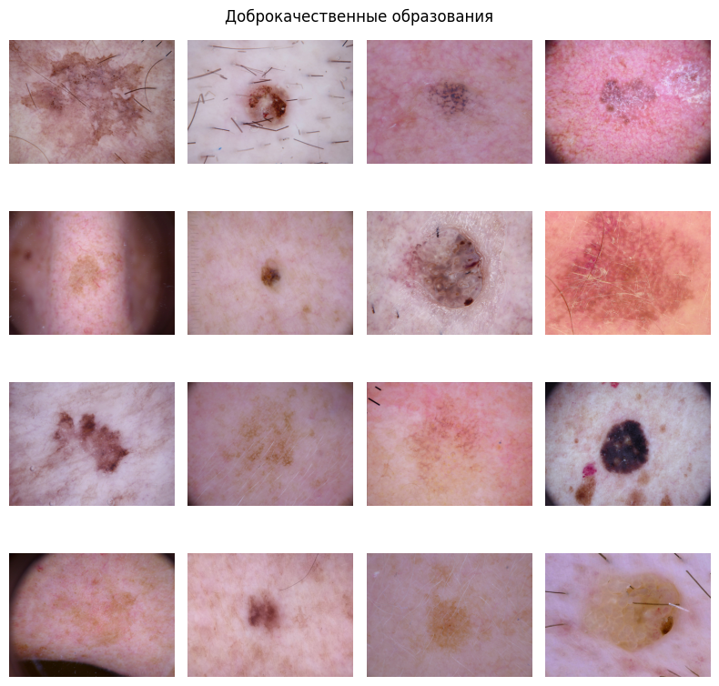
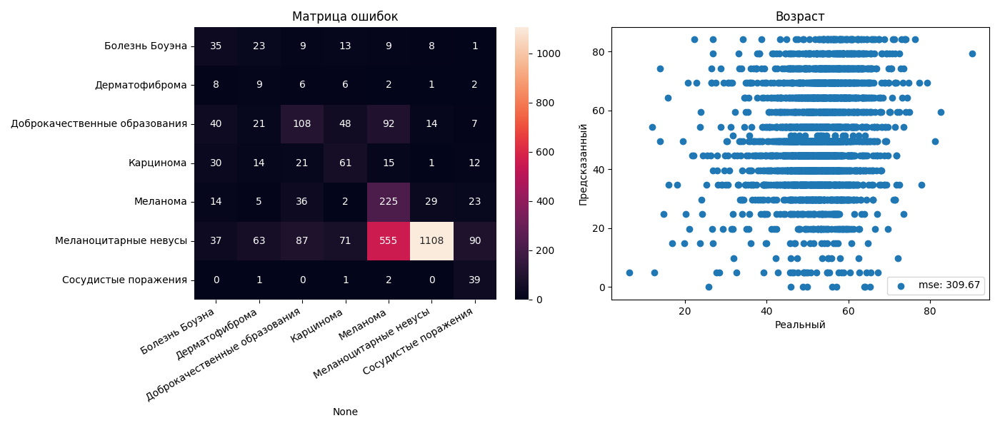

# Model card

**skin_disease v0.1.0**

Модель машинного обучения для классификации кожных заболеваний по микроскопическим снимкам.

---

## Данные

### Датасет
Датасетом для обучения и валидации является [skin-cancer-mnist-ham10000](https://www.kaggle.com/datasets/kmader/skin-cancer-mnist-ham10000).
Он состоит из 10000 микроскопических снимков 500x500px кожных заболеваний, принадлежащих 7 классам:

* Сосудистые поражения
* Меланоцитарные невусы
* Меланома
* Дерматофиброма
* Доброкачественные образования
* Карцинома
* Болезнь Боуэна

### Пример данных

Также в датасете есть информация о возрасте и поле пациентов.

Датасет распределен на тренировочную, валидационную и тестовую выборки в соотношении 5:3:2.

### Препроцессинг и аугментации

Во время препроцессинга изображения нормализуются, обрезаются до 400x400, затем сжимаются до 224x224.
От возраста пациента берется логарифм и делится на 4.5, что приводит его к диапазону [0, 1].

В качестве аугментаций применяются случайные отражения и развороты изображений.

## Модель

В качестве бейзлайна выбран бэкбоун Resnet50 с классификационной и регрессионной головой.

Это мультитаск модель, определяющая по изображению возраст пациента и его патологию.

## Обучение

При обучении применялось [использование Uncertainty для взвешивания функций ошибок](https://arxiv.org/pdf/1705.07115v3.pdf).

В качестве learning rate scheduler'а использовался [1cycle](https://paperswithcode.com/method/1cycle)

В качестве сэмплера данных использован [mperclasssampler](https://kevinmusgrave.github.io/pytorch-metric-learning/samplers/#mperclasssampler)

## Валидационные метрики

